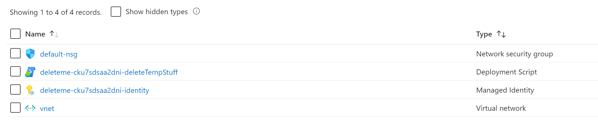
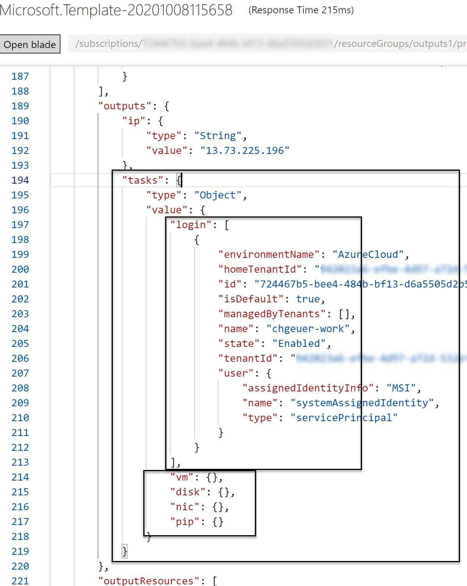
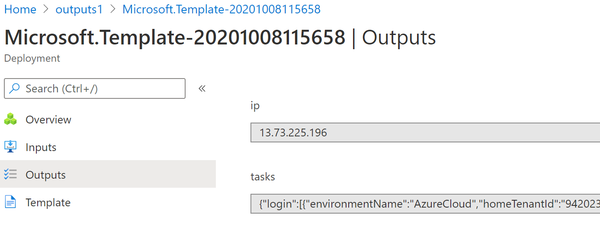

# [arm_marketplace_vm_delete_post_deploy](https://github.com/chgeuer/arm_marketplace_vm_delete_post_deploy#Deploy)

## Deploy

 

## What is it

Goal if this template is to be executed with a managed application deployment from Azure Marketplace.

- Subscription should be allow-listed to use a hidden VM image
- Customer should not be forced to opt in manually
- Template should deploy a single (tiny) VM within the template, which automagically registers the subscription to enlist in the plan
- Post VM deployment, a deploymentScript should delete the VM (and NIC and Disk) again
- To do that, deploymentScript needs Contributor role assignement on managed resource group

## Screenshots

### Target goal resource group with VNET and NSG

### Outputs from the shell script within `deploymentScript`

